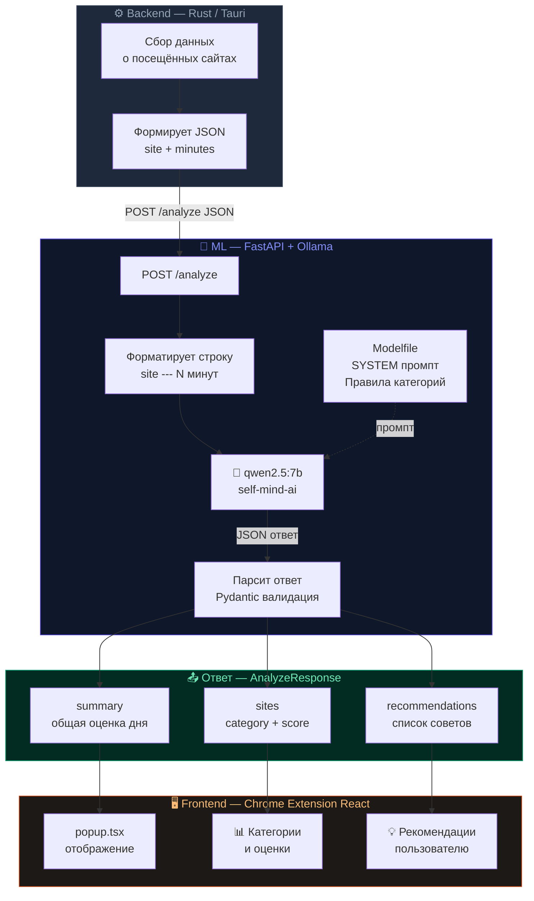

```mermaid
flowchart TD
    subgraph BACKEND["⚙️ Backend — Rust / Tauri"]
        A[Сбор данных\nо посещённых сайтах]
        B[Формирует JSON\nsite + minutes]
    end

    subgraph ML["🧠 ML — FastAPI + Ollama"]
        C["POST /analyze"]
        D[Форматирует строку\nsite --- N минут]
        E[🤖 qwen2.5:7b\nself-mind-ai]
        F[Modelfile\nSYSTEM промпт\nПравила категорий]
        G[Парсит ответ\nPydantic валидация]
    end

    subgraph RESPONSE["📤 Ответ — AnalyzeResponse"]
        H[summary\nобщая оценка дня]
        I[sites\ncategory + score]
        J[recommendations\nсписок советов]
    end

    subgraph FRONTEND["🖥️ Frontend — Chrome Extension React"]
        K[popup.tsx\nотображение]
        L[📊 Категории\nи оценки]
        M[💡 Рекомендации\nпользователю]
    end

    A --> B
    B -->|POST /analyze JSON| C
    C --> D
    D --> E
    F -.->|промпт| E
    E -->|JSON ответ| G
    G --> H
    G --> I
    G --> J
    H --> K
    I --> L
    J --> M

    style BACKEND  fill:#1e293b,color:#94a3b8,stroke:#334155
    style ML       fill:#0f172a,color:#818cf8,stroke:#4338ca
    style RESPONSE fill:#022c22,color:#6ee7b7,stroke:#059669
    style FRONTEND fill:#1c1917,color:#fdba74,stroke:#c2410c
```
