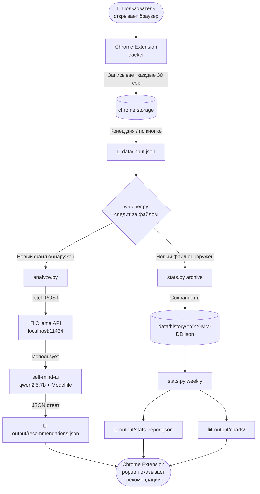

```mermaid
flowchart TD
    A([👤 Пользователь\nоткрывает браузер]) --> B[Chrome Extension\ntracker]
    B -->|Записывает каждые 30 сек| C[(chrome.storage)]
    C -->|Конец дня / по кнопке| D[📄 data/input.json]
    D --> E{watcher.py\nследит за файлом}
    E -->|Новый файл обнаружен| F[analyze.py]
    E -->|Новый файл обнаружен| G[stats.py archive]
    F -->|fetch POST| H[🤖 Ollama API\nlocalhost:11434]
    H -->|Использует| I[self-mind-ai\nqwen2.5:7b + Modelfile]
    I -->|JSON ответ| J[📄 output/recommendations.json]
    G -->|Сохраняет в| K[(data/history/YYYY-MM-DD.json)]
    K --> L[stats.py weekly]
    L --> M[📄 output/stats_report.json]
    L --> N[📊 output/charts/]
    J --> O([Chrome Extension\npopup показывает\nрекомендации])
    M --> O
    N --> O
```
